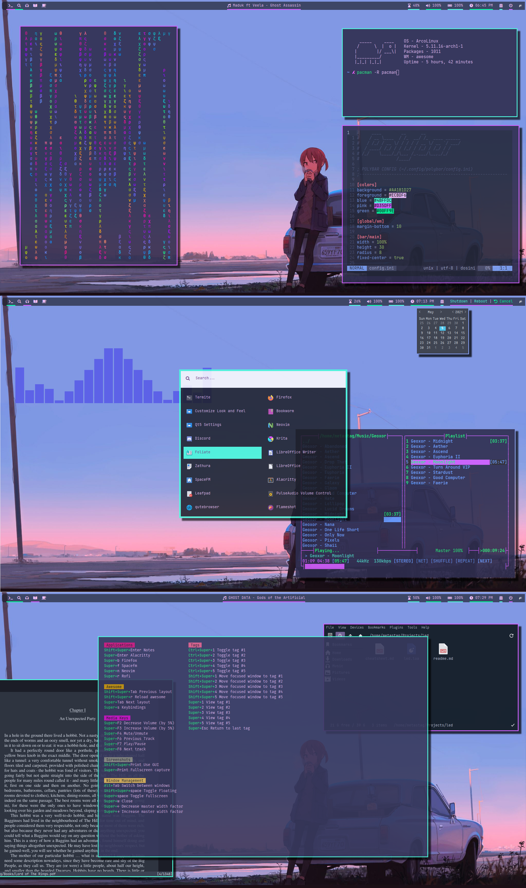

# Dotfiles

**ⵃ Thanks for visiting!**

Tools I use:

   ▴ **WM** -> [Awesome](https://awesomewm.org/)

   ▴ **Terminal** -> [Alacritty](https://github.com/alacritty/alacritty), [Termite](https://github.com/thestinger/termite)

   ▴ **Bar** -> [Polybar](https://polybar.github.io/)

   ▴ **Editor** -> [Neovim](https://neovim.io/)

   ▴ **GTK Theme** -> [Lumiere, Noita](https://github.com/addy-dclxvi/gtk-theme-collections)

   ▴ **Font** -> [JetBrains Mono](https://www.jetbrains.com/lp/mono/)

   ▴ **Matrix in terminal** -> [Unimatrix](https://github.com/will8211/unimatrix) (Command is `unimatrix -lg -s 95 | lolcat`)

   ▴ **File Manager** -> [SpaceFM](http://ignorantguru.github.io/spacefm/)

   ▴ **Application Launcher** -> [Rofi](https://github.com/davatorium/rofi) (Modified from [here](https://github.com/adi1090x/rofi))

   ▴ **Music Visualizer** -> [Glava](https://github.com/jarcode-foss/glava)

   ▴ **Display Manager** -> [Sddm](https://github.com/sddm/sddm/)

   ▴ **PDF Reader** -> [Zathura](https://pwmt.org/projects/zathura/)

---
