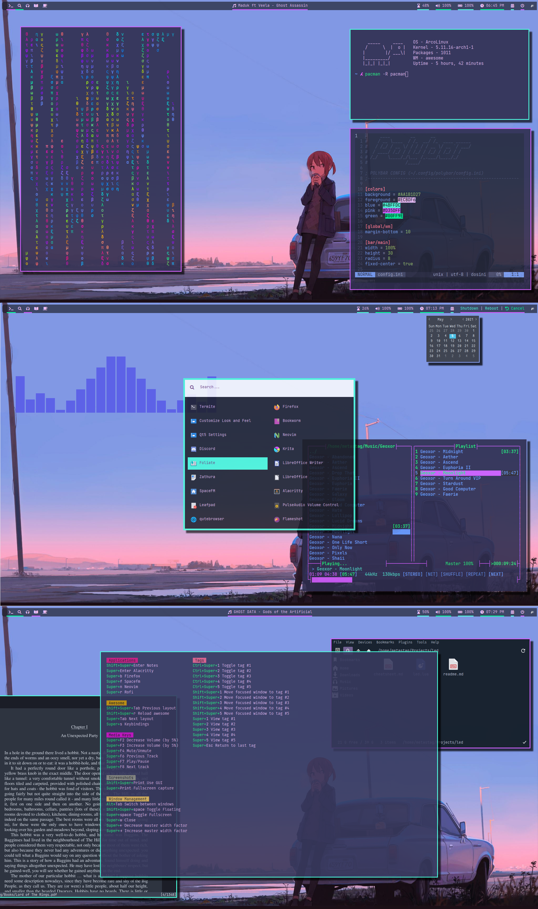
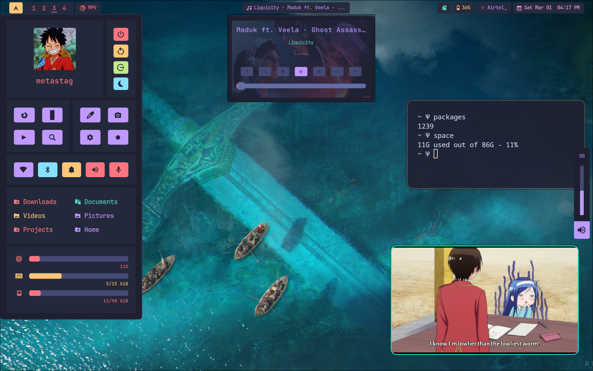

<h1 align='center'>Dotfiles</h1>

**ⵃ Thanks for visiting!**

Tools I use:

   ▴ **WM** -> [Awesome](https://awesomewm.org/)

   ▴ **Terminal** -> [Alacritty](https://github.com/alacritty/alacritty), [Termite](https://github.com/thestinger/termite)

   ▴ **Bar** -> [Polybar](https://polybar.github.io/)

   ▴ **Editor** -> [Neovim](https://neovim.io/)
   
   ▴ **Application Launcher** -> [Rofi](https://github.com/davatorium/rofi) (Modified from [here](https://github.com/adi1090x/rofi))

   ▴ **GTK Theme** -> [Lumiere, Noita](https://github.com/addy-dclxvi/gtk-theme-collections)

   ▴ **Font** -> [JetBrains Mono](https://www.jetbrains.com/lp/mono/)

   ▴ **Matrix in terminal** -> [Unimatrix](https://github.com/will8211/unimatrix) (Command is `unimatrix -lg -s 95 | lolcat`)

   ▴ **File Manager** -> [SpaceFM](http://ignorantguru.github.io/spacefm/)
   
   ▴ **Music Player** => [Moc](http://moc.daper.net/)

   ▴ **Music Visualizer** -> [Glava](https://github.com/jarcode-foss/glava)

   ▴ **Display Manager** -> [Sddm](https://github.com/sddm/sddm/)

   ▴ **PDF Reader** -> [Zathura](https://pwmt.org/projects/zathura/)
   
   ▴ **Book** -> [The Hobbit / Lord of the Rings](https://en.wikipedia.org/wiki/The_Lord_of_the_Rings)
   
---

**Hyprland Config**

   ▴ **WM** -> [Hyprland](https://hyprland.org/)
   
   ▴ **Terminal** -> [Kitty](https://github.com/kovidgoyal/kitty)
   
   ▴ **Bar** -> [Hyprpanel](https://hyprpanel.com/)
   
   ▴ **GTK Theme** -> [Juno Ocean](https://www.gnome-look.org/p/1280977)
   
   ▴ **SDDM Theme** -> [Sddm Astronaut theme](https://github.com/Keyitdev/sddm-astronaut-theme)
   

Rest of the things not mentioned are same as AwesomeWM config above
